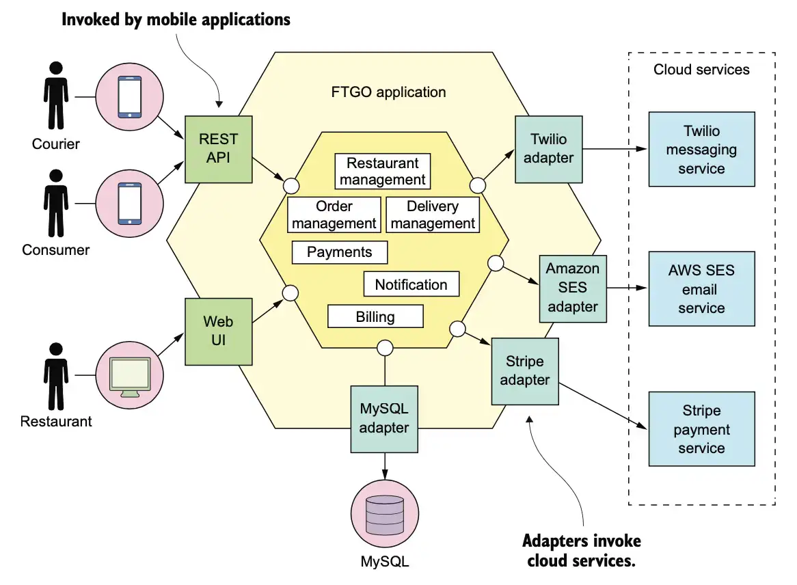
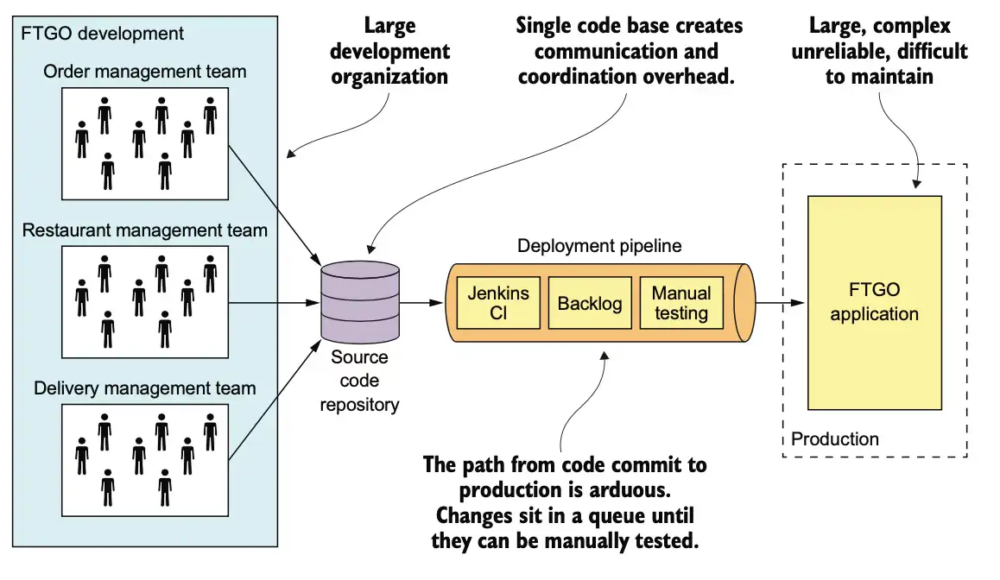
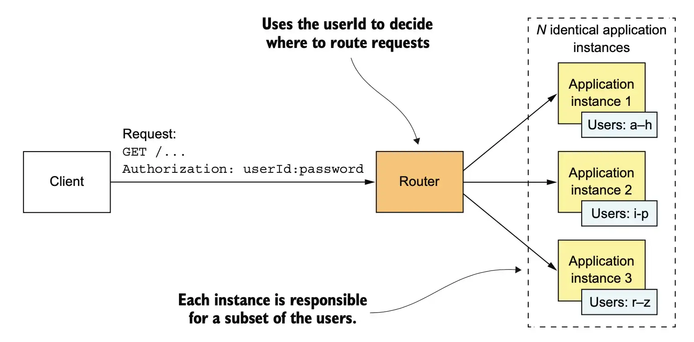
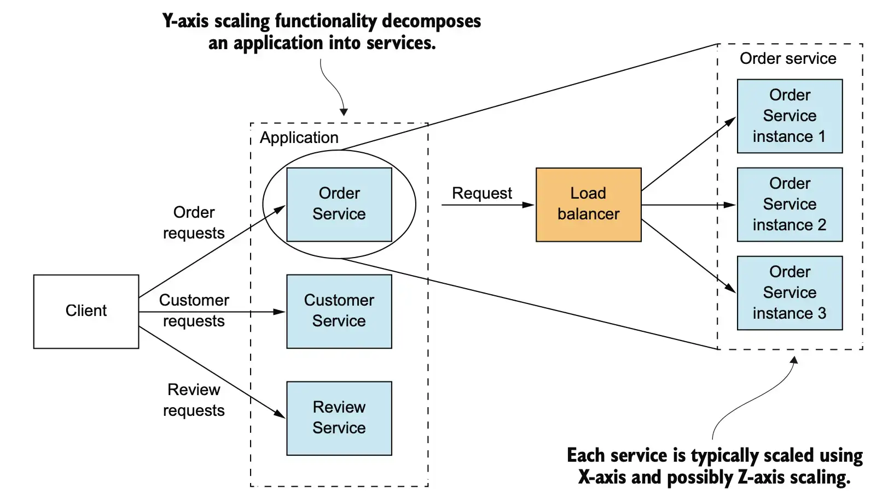
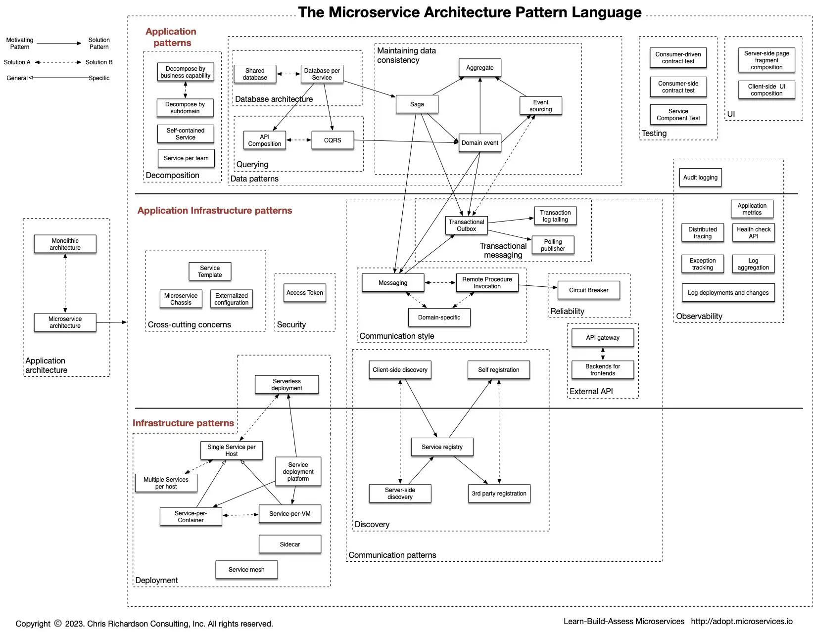

# Introduction to Microservices

## Monolithic Architecture

### Benefits of Monolithic Architecture
When applications are relatively small, a monolithic architecture offers numerous advantages:

* **Simplicity in Development**: Integrated Development Environments (IDEs) and developer tools are optimized for building a single application.
* **Ease of Radical Changes**: Developers can change the code and database schema, then build and deploy the application seamlessly.
* **Straightforward Testing**: End-to-end tests can be written to launch the application, invoke the REST API, and test the UI with tools like Selenium.
* **Simple Deployment**: Developers simply copy the WAR file to a server with Tomcat installed for deployment.
* **Scalability**: Applications can run multiple instances behind a load balancer, enhancing performance.

### Challenges of Monolithic Architecture
As successful applications grow, they often outgrow the monolithic architecture, leading to various challenges:

* **Slow Development**: The lengthy build process and slow startup times hinder productivity, making the edit-build-run-test cycle inefficient.
* **Long Deployment Path**: Updating production becomes cumbersome, often limiting updates to once a month and making continuous deployment nearly impossible.
* **Difficult Scaling**: Conflicting resource requirements among application modules complicate server configuration.
* **Testing Challenges**: The large size of the application makes thorough testing difficult, allowing bugs to slip into production.
* **Obsolete Technology Stack**: The monolithic structure hampers the adoption of new frameworks and languages, as rewriting the entire application is costly and risky.

### The Scale Cube

1. **X-axis Scaling**: Involves running multiple instances of the monolithic application behind a load balancer to handle increased load.

   

2. **Z-axis Scaling**: Each instance is responsible for only a subset of the data, allowing for more efficient resource usage (e.g., routing requests by userId).

   

3. **Y-axis Scaling**: Introduces functional decomposition, where each service is a mini-application implementing focused functionality.

   

## Microservice Architecture

**Software architecture influences quality of service requirements (nonfunctional requirements) significantly, despite having little to do with functional requirements**. A disciplined team can mitigate some issues, but they cannot escape the inherent challenges of a large team working on a single monolithic application.

A growing consensus suggests that for large, complex applications, a microservice architecture should be considered. According to Adrian Cockcroft, formerly of Netflix, a **microservice architecture is a service-oriented architecture made up of loosely coupled elements with bounded contexts**.

According to Chris Richardson, **it is an architecture that structures the application as a set of two or more independently deployable, loosely coupled, components, a.k.a. services**. Each service consists of one or more subdomains and is owned by the team (or teams) that owns the subdomains. In order to be independently deployable each service typically has its own source code repository and its own deployment pipeline, which builds, tests and deploys the service.

## Benefits and Drawbacks of Microservice Architecture

### Benefits
* **Continuous Delivery**: Supports the ongoing delivery and deployment of complex applications.
* **Maintainability**: Smaller services are easier to maintain and update.
* **Independent Deployment**: Services can be deployed independently, minimizing downtime.
* **Independent Scalability**: Services can scale according to specific demands.
* **Team Autonomy**: Teams can operate independently, fostering innovation.
* **Adoption of New Technologies**: Easier to experiment with and integrate new technologies.
* **Fault Isolation**: Issues in one service do not impact others.

### Drawbacks
* **Complex Distributed Systems**: Developing, testing, and deploying distributed systems introduces complexity.
* **Coordination of Features**: Deploying features that span multiple services requires meticulous coordination.
* **Adoption Timing**: Deciding when to transition to a microservice architecture can be difficult.

## Microservices Architecture Language Pattern

The [Microservices Architecture Language Pattern](https://microservices.io/patterns/) is a structured framework that provides a common vocabulary for designing and implementing microservices, addressing the challenges of distributed systems. Aligned with the principles of the [12-Factor App](https://12factor.net/), it emphasizes modularity, scalability, and the separation of concerns. The pattern offers solutions for service decomposition, communication, data management, and resiliency, ensuring that services remain loosely coupled but highly cohesive. By incorporating principles like configuration management, dependency isolation, and statelessness, the language pattern helps ensure that microservices are resilient, easy to scale, and maintainable, supporting cloud-native and continuously deployed applications.

### Communication Patterns
- **API Gateway**: Acts as a single entry point for client requests, routing them to the appropriate microservices.
- **Remote Procedure Invocation (RPI)**: Services directly invoke remote services using protocols like HTTP/REST, gRPC, or SOAP.

### Service Discovery Patterns
- Client-Side Discovery: Clients are responsible for discovering the network locations of available service instances using a service registry (e.g., Eureka, Consul).
- Server-Side Discovery: The client sends requests to a load balancer, which queries the service registry to route traffic to available instances.
- Service Registry: A central repository (e.g., etcd, Consul, Zookeeper) where services register themselves and clients discover service instances.

### Routing Patterns
- API Gateway: Routes requests from clients to appropriate microservices, often handling cross-cutting concerns such as authentication, rate limiting, and logging.
- Backend for Frontend (BFF): Creates dedicated backend services tailored for different frontends (e.g., mobile apps, web apps) to improve performance and user experience.

### Configuration Patterns
- **Externalized Configuration**: Configuration data is stored outside the application code, often in centralized configuration servers (e.g., Spring Cloud Config, Consul).
- **Environment-Based Configuration**: Services load specific configurations depending on the environment (e.g., development, testing, production).

### Resiliency Patterns
- **Circuit Breaker**: Prevents a service from repeatedly calling a failing service by breaking the circuit after a series of failures, allowing it to recover (e.g., Hystrix, Resilience4j).
- **Bulkhead**: Isolates critical resources by partitioning them into distinct "bulkheads" to prevent cascading failures from affecting the entire system.
- **Retry Pattern**: Automatically retries failed requests a specified number of times before giving up, often used in combination with the Circuit Breaker.
- **Timeout**: Defines time limits for service requests to prevent the system from waiting indefinitely for responses.

### Observability Patterns
- **Log Aggregation**: Centralizes logs from all services for easy access, searching, and correlation (e.g., ELK Stack: Elasticsearch, Logstash, Kibana).
- **Distributed Tracing**: Tracks requests across service boundaries, providing visibility into request flows and latencies (e.g., Jaeger, Zipkin).
- **Metrics Collection**: Gathers performance and health metrics from services (e.g., Prometheus, Grafana).
- **Health Check Endpoint**: Services expose health check APIs that can be used by monitoring systems or load balancers to verify service status.

### Distributed Transactions Patterns
- **Saga**: Manages distributed transactions by coordinating a series of local transactions, using either event-based or command-based approaches.
- **Two-Phase Commit (2PC)**: Ensures distributed consistency by first preparing all participating services for a transaction, then committing it only if all services are ready.

### DevOps Patterns
- **CI/CD Pipeline**: Automates the process of code integration, testing, and deployment to ensure faster, reliable, and frequent releases (e.g., Jenkins, GitLab CI).
- **Infrastructure as Code (IaC)**: Manages and provisions infrastructure through machine-readable configuration files (e.g., Terraform, Ansible).
- **Blue-Green Deployment**: Deploys a new version of the service (green) alongside the existing version (blue) and switches traffic once the new version is verified.
- **Canary Release**: Gradually rolls out a new version of the service to a subset of users, allowing teams to monitor for issues before a full release.

### MLOps Patterns (for AI and Machine Learning-based Microservices)
- **Model Versioning**: Manages different versions of machine learning models, ensuring that the right version is deployed alongside microservices (e.g., MLflow).
- **Model Serving**: Deploys machine learning models as a microservice, providing APIs for real-time predictions (e.g., TensorFlow Serving, KFServing).
- **Feature Store**: Provides a centralized repository to manage and serve machine learning features used by different models and microservices.
- **Continuous Training (CT)**: Automates the retraining of models based on new data, integrating into CI/CD pipelines to keep models up to date.

## Forces Behind Microservices

The transition to microservices architecture is influenced by several significant forces that collectively enhance the development, deployment, and operational capabilities of software applications.

### Cloud Computing

Cloud computing provides the infrastructure and services necessary for building, deploying, and managing applications without the need for extensive on-premises hardware.

- **Platform Support**: Major cloud providers like **Amazon Web Services (AWS)** and **Microsoft Azure** offer robust environments specifically designed to support microservices. These platforms provide a range of services that facilitate microservices development, including:
   - **Elastic Load Balancing**: Automatically distributes incoming application traffic across multiple targets, such as EC2 instances or containers, ensuring high availability and fault tolerance.
   - **Container Orchestration**: Services like **Amazon ECS** (Elastic Container Service) and **Azure Kubernetes Service** (AKS) manage the deployment, scaling, and operation of containerized applications, simplifying the complexity of managing microservices.
   - **Serverless Computing**: Options like **AWS Lambda** and **Azure Functions** allow developers to run code in response to events without provisioning servers, enhancing agility and reducing operational overhead.
- **Scalability and Flexibility**: Cloud platforms enable organizations to scale their applications on-demand, responding quickly to changing workloads. This flexibility supports the independent scaling of microservices based on usage patterns, enhancing resource efficiency.

### Containers

Containers encapsulate an application and its dependencies into a single unit that can be deployed consistently across various environments.

- **Portability**: Technologies like **Docker** provide a standardized environment for applications, allowing developers to build, ship, and run applications in containers regardless of the underlying infrastructure. This ensures that applications behave the same way in development, testing, and production environments.
- **Efficiency**: Containers use system resources more efficiently than traditional virtual machines. They share the host OS kernel, which reduces overhead and allows for faster startup times. This efficiency is crucial for microservices, where numerous services may need to run concurrently.
- **Isolation**: Each microservice can run in its own container, isolated from others, minimizing the risk of conflicts and simplifying dependency management. This isolation also contributes to fault tolerance, as the failure of one service does not impact others.

### DevOps

DevOps is a cultural and technical movement aimed at improving collaboration between development and operations teams, facilitating faster software delivery.

- **Continuous Delivery**: The DevOps approach emphasizes the automation of the software development lifecycle, allowing for continuous integration and continuous delivery (CI/CD) of microservices. This enables:
   - Frequent updates and feature releases without disrupting the overall system.
   - Faster feedback loops, helping teams identify and resolve issues quickly.
- **Improved Software Quality**: Automated testing and deployment pipelines ensure that new code is thoroughly tested before release, reducing the likelihood of bugs and improving the overall quality of the software. With microservices, each service can be independently tested and deployed, promoting a more agile development process.
- **Cultural Shift**: DevOps fosters a culture of collaboration, shared responsibility, and transparency, which is essential for the successful implementation of microservices. Teams are encouraged to take ownership of their services, leading to better quality and faster innovation.

### Edge AI

The rise of artificial intelligence (AI) and edge computing necessitates the need for architectures that can efficiently handle distributed data processing and real-time analytics.

- **Microservices for Data-Intensive Applications**: Microservices are well-suited for applications that require data processing at scale, as they allow teams to build specialized services tailored to specific functions, such as data ingestion, processing, and storage.
- **Edge Computing**: With the proliferation of IoT devices and the need for low-latency processing, edge computing moves data processing closer to the source of data generation. Microservices can be deployed at the edge to process data locally, reducing the need to send large volumes of data to centralized servers and minimizing latency.
- **AI Workloads**: Microservices architecture enables organizations to deploy AI models and algorithms as independent services, allowing for modular updates and easier experimentation. This modularity is vital for maintaining and evolving AI systems, which often require constant retraining and adjustment.
