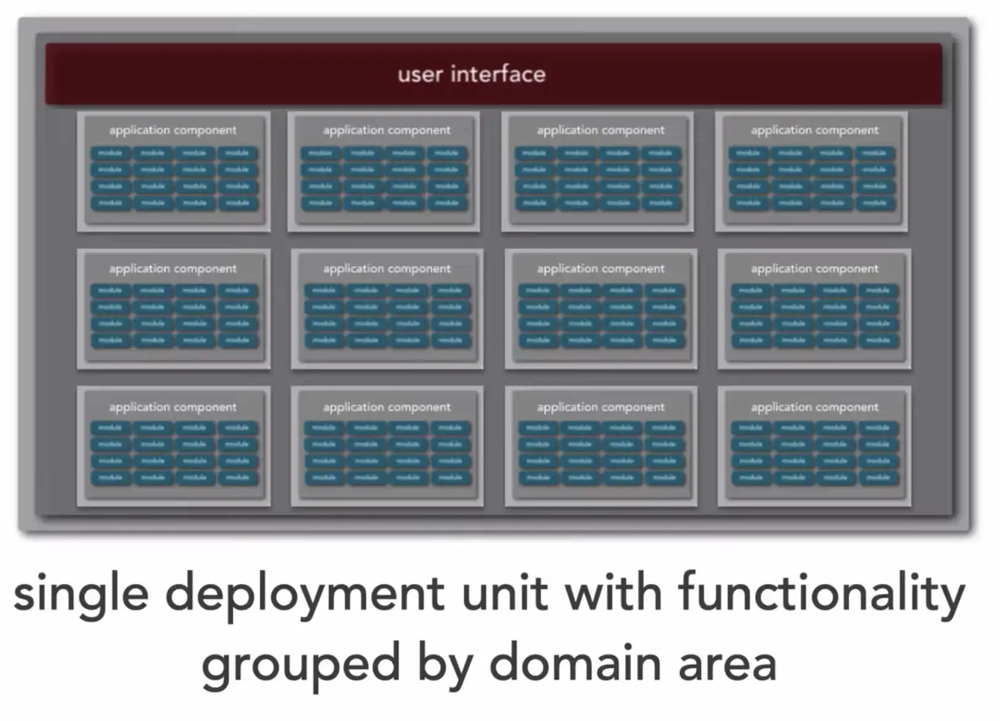
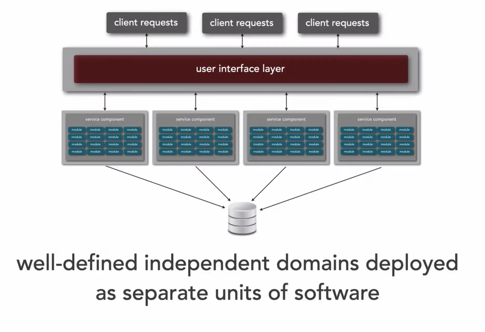
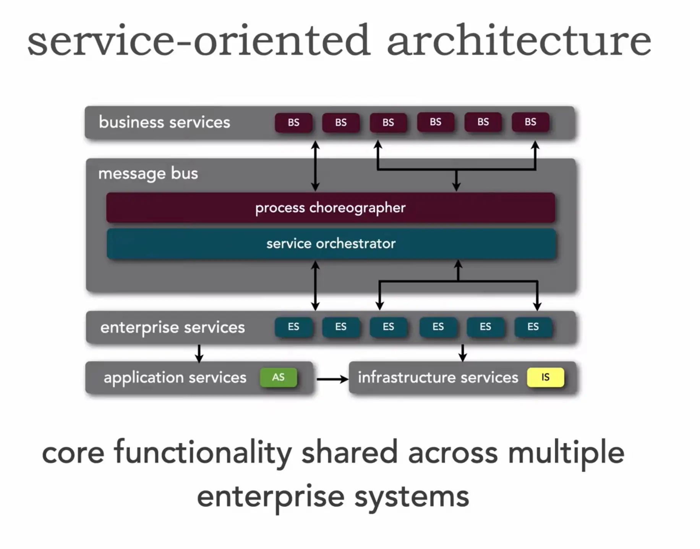
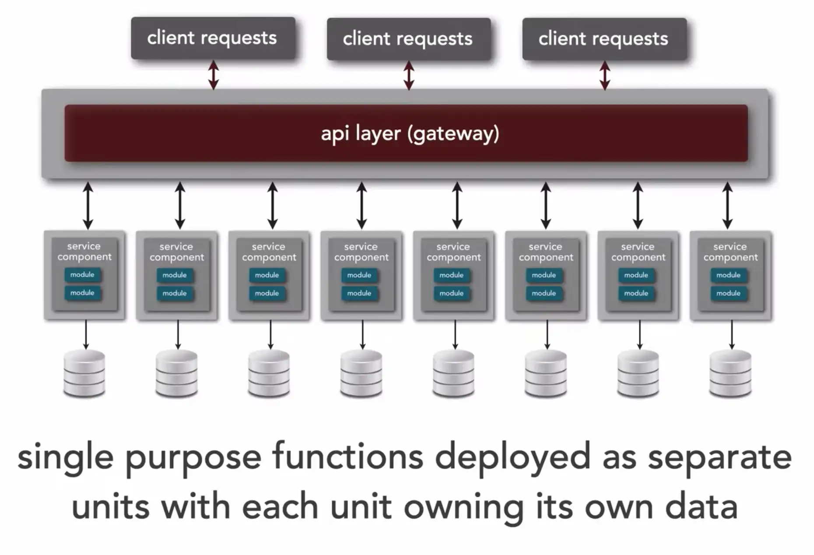

# Architectural styles

## What is software architecture exactly?

[Len Bass and colleagues](https://books.google.it/books?id=-II73rBDXCYC&printsec=frontcover&redir_esc=y#v=onepage&q&f=false) defined it as: *The software architecture of a computing system is the set of structures needed to reason about the system, which comprise software elements, relations among them, and properties of both.*

[David Garlan and colleagues](https://books.google.it/books/about/Software_Architecture.html?id=fh_kjgEACAAJ&redir_esc=y) defined it as: *something that defines a family of such systems in terms of a pattern of structural organization. More specifically, an architectural style determines the vocabulary of components and connectors that can be used in instances of that style, together with a set of constraints on how they can be combined.*

In software, architecture styles can be classified into two main types: **monolithic** (single deployment unit of all code) and **distributed** (multiple deployment units connected through remote access protocols).

## Monolithic Architecture

Many small-to-medium web-based applications are built using a monolithic architectural style. In a monolithic architecture, an application is delivered as a single deployable software artifact. All of the UI, business, and database access logic are packaged together into a unique application and deployed to an application server. 

Although monolithic applications are sometimes described in negative terms by proponents of microservices architecture, these are often a great choice. Monoliths are easier to build and deploy than more complex architectures like n-tier or microservices. If your use case is well defined and unlikely to change, it can be a good decision to start with a monolith.

**When an application begins to increase in size and complexity, however, monoliths can become difficult to manage**. Each change to a monolith can have a cascading effect on other parts of the application, which may make it time consuming and expensive, especially in a production system. 

### Layered architecture

One common type of enterprise architecture is the multi-layered or n-tier architecture. With this design, an applications is divided into multiple layers, each with their own responsibilities and functions, such as UI, services, data, testing, and so forth.

Benefits:
* N-tier applications offer good separation of concerns, making it possible to consider areas like UI (user interface), data, and business logic separately.
* It’s easy for teams to work independently on different components of n-tier applications.
* Because this is a well-understood enterprise architecture, it’s relatively easy to find skilled developers for n-tier projects.

Drawbacks:
* You must stop and restart the entire application when you want to make a change.
* Messages tend to pass up and down through the layers, which can be inefficient.
* Refactoring is difficult (you have to change all layers).

When to use:
* When developing simple applications, it is advisable to implement a layered architecture because it’s the simplest framework. 
* Can be used for applications that need to be built quickly because it’s easy to learn and implement. It is also good in cases where the developers do not have a lot of knowledge of software architectures or when they are undecided on which one to use.

| **Feature**      | **Score** |
|------------------|-----------|
| maintainability  | *         |
| testability      | *         |
| deployability    | *         |
| cost             | * * * * * |
| abstraction      | *         |
| scalability      | *         |
| elasticity       | *         |
| fault-tolerance  | *         |
| interoperability | *         |
| performance      | *         |
| evolvability     | *         |
| simplicity       | * * * * * |

### Clean Architecture

Clean Architecture is an approach designed to make systems more maintainable, flexible, and testable. It emphasizes a separation of concerns by organizing the software into distinct layers, where the inner layers are not dependent on the outer ones. This architecture focuses on creating independent and reusable components, with clear rules for how different parts of the application should interact.

Benefits:
* Clean Architecture promotes high decoupling between components, ensuring that changes in one part of the system do not affect others.
* It enhances the testability of the system, allowing developers to test business logic independently from external factors like UI or databases.
* Due to its modular nature, it's easier to replace or upgrade parts of the system (e.g., databases, UI frameworks) without impacting core business logic.

Drawbacks:
* It requires a steeper learning curve and a deeper understanding of architecture principles.
* Clean Architecture can introduce complexity for smaller projects where such an advanced level of structure might not be necessary.
* Overhead from creating multiple abstraction layers can slow down the initial development process.

When to use:
* Recommended when working on systems that need to evolve over time, or where different teams may be responsible for different components.
* It’s particularly useful when there is a high level of business logic that needs to remain isolated from external dependencies like UI or databases.

| **Feature**      | **Score** |
|------------------|-----------|
| maintainability  | * *       |
| testability      | * *       |
| deployability    | * *       |
| cost             | * * * * * |
| abstraction      | * *       |
| scalability      | *         |
| elasticity       | *         |
| fault-tolerance  | *         |
| interoperability | *         |
| performance      | *         |
| evolvability     | *         |
| simplicity       | * * *     |

### Modular Monolithic Architecture

Instead of using layered architecture with horizontal logical layers, we can organize our code across vertical slices of business functionality.These slices are determined based on business demands, rather than enforced by technical constraints. When we add or change a feature in an application, our changes are scoped to the area of business concern not technical logical layers.

Modular monolithic architecture divides application logic into independent and isolated modules with business logic, database schema. Modules can be a potential microservices when need to independently deployed and scale in future refactorings (read more about [Strangler Pattern](https://microservices.io/patterns/refactoring/strangler-application.html)).

Benefits:
* **Encapsulate Business Logic**: Business logics are encapsulated in Modules and it enables high reusability, while data remains consistent and communication patterns simple.
* **Reusable Codes, Easy to Refactor**: For large development teams, developing modular components of an application will increase reusability. Modular components can be reused that can help teams establish a single source of truth.
* **Better for teams**: Easier for developers to work on different parts of the code. with Modular Monolithic architecture, we can divide our developer teams effectively and implement business requirements with minimum affect to each other.

Drawbacks:
* **Can't diversifying technology**: Modular monoliths don't provide all benefits of microservices. If you need to diversify technology and language choices, you can't do it with Modular Monolithic Architecture. 
* **Can't Scale and Deploy Independently**: Since the application is a single unit, it can't be scale separated parts or deploy independently like microservices.

When to use:
* **Strict Consistency is Mandatory Cases**: For many companies unable to make the move to microservices, due to their database and data not appreciate for distributed architecture. For example if your application store high important data like debit on bank account, then you need strong data consistency that means your data should be correct for every time, if you got any exception you have to rollback immediately.
* **Modernization**: If you already have a big complex monolithic application running, the modular monolith is the perfect architecture to help you refactor your code to get ready for a potential microservices architecture. Instead of jumping into microservices, you can move modular monolithic without effecting your business and get benefits like speed up with a well-factored modular monolith.
* **Green Field Projects**: A modular monolith allow you to learn your domain and pivot your architecture much faster than a microservices architecture. You won't have to worry about things like Kubernetes and a services mesh at day 1. Your deployment topology will be drastically simplified.

| **Feature**      | **Score** |
|------------------|-----------|
| maintainability  | * *       |
| testability      | * *       |
| deployability    | * *       |
| cost             | * * * * * |
| abstraction      | *         |
| scalability      | *         |
| elasticity       | *         |
| fault-tolerance  | *         |
| interoperability | *         |
| performance      | * * *     |
| evolvability     | *         |
| simplicity       | * * * * * |

### Big Ball of Mud
A Big Ball of Mud is a haphazardly structured, sprawling, sloppy, duct-tape-and-baling-wire, spaghetti-code jungle. These systems show unmistakable signs of unregulated growth, and repeated, expedient repair. Information is shared promiscuously among distant elements of the system, often to the point where nearly all the important information becomes global or duplicated - *Brian Foote and Joseph Yoder*

Each dot on the perimeter of the circle represents a class, and each line represents connections between the classes, where bolder lines indicate stronger connections.

## Distributed Architecture

### Service-based architecture

Service-Based Architecture is a software design approach where an application is divided into small, independent services that perform specific functions. Each service runs in its own process and communicates with other services through well-defined APIs, often using protocols like HTTP or messaging queues. This architecture focuses on separating services by business capability, providing flexibility and scalability.

Benefits:
* Service-Based Architecture allows independent development, testing, and deployment of services, making it easier to update or replace them without affecting the entire system.
* It scales well, as individual services can be scaled horizontally based on specific needs, ensuring efficient resource utilization.
* Teams can work on different services simultaneously, improving development speed and productivity.

Drawbacks:
* Communication between services can introduce latency and complexity, particularly when dealing with distributed systems.
* It requires strong governance around service contracts, versioning, and dependency management to avoid breaking changes.
* Debugging and monitoring can be challenging due to the distributed nature of services.

When to use:
* Best suited for medium to large-scale applications where different teams are responsible for different business functions.
* Ideal when the application needs to scale parts of the system independently based on user demand or performance requirements.
* Useful when flexibility and independent deployment of different parts of the application are key business priorities.

| **Feature**      | **Score** |
|------------------|-----------|
| maintainability  | * * * *   |
| testability      | * * * *   |
| deployability    | * * * *   |
| cost             | * * * *   |
| abstraction      | *         |
| scalability      | * * *     |
| elasticity       | * *       |
| fault-tolerance  | * * * *   |
| interoperability | * *       |
| performance      | * * *     |
| evolvability     | * * *     |
| simplicity       | * * *     |

### Service-oriented architecture

Service-Oriented Architecture (SOA) is a design paradigm where software components (services) provide functionality through standardized interfaces and protocols. In SOA, services are reusable, self-contained units that can be discovered and invoked over a network, often using protocols like SOAP or REST. These services interact with each other to form complete business processes, promoting loose coupling and modularity.

Benefits:
* SOA promotes reuse of services across different applications, reducing duplication and development effort.
* It enhances flexibility, as services can be reused and recomposed to form new business processes without the need to redesign the entire system.
* By decoupling services from each other, it supports integration across heterogeneous platforms and technologies, making it ideal for enterprises with diverse systems.

Drawbacks:
* The added complexity of managing service orchestration and communication can increase the difficulty of implementation.
* SOA can introduce performance overhead due to the reliance on network communication and the use of standardized protocols like SOAP, which can be heavy.
* Governance and security become more critical as multiple services and interfaces need to be managed and secured properly.

When to use:
* SOA is well-suited for large enterprise systems that need to integrate multiple, heterogeneous applications and platforms.
* It is ideal when there is a need for business processes to span across different systems or when functionality needs to be exposed to external partners.
* SOA is beneficial when the system needs to support scalable, modular, and reusable services, enabling agile responses to changing business requirements.

| **Feature**      | **Score** |
|------------------|-----------|
| maintainability  | *         |
| testability      | *         |
| deployability    | *         |
| cost             | *         |
| abstraction      | * * * * * |
| scalability      | * * *     |
| elasticity       | * * *     |
| fault-tolerance  | * * *     |
| interoperability | * * * * * |
| performance      | * *       |
| evolvability     | *         |
| simplicity       | *         |

### Microservices Architecture

Microservice architecture is a modern approach where an application is divided into small, independent services. Each service focuses on a specific business function and can be developed, deployed, and scaled independently. These services communicate with each other using lightweight protocols, often over HTTP or messaging queues.

Benefits:
* Microservice architecture offers excellent separation of concerns, allowing each service to handle a specific part of the business logic or functionality independently. Services can be build around a common chassis for simplified development (read more on [Chassis Pattern](https://microservices.io/patterns/microservice-chassis.html)).
* Teams can work on different services in parallel, which accelerates development and deployment cycles.
* It enables easy scalability, as individual services can be scaled based on demand without impacting the entire system.

Drawbacks:
* Managing the communication between services can become complex, especially as the number of microservices grows.
* Debugging and monitoring across distributed services require specialized tools and techniques.
* It can lead to operational overhead since each service may have its own database, technology stack, or deployment requirements.

When to use:
* Microservice architecture is ideal for complex, large-scale applications where independent scalability and flexibility are key requirements.
* It’s particularly useful when different parts of the system have different load and performance characteristics, requiring separate scaling.
* Recommended for teams with advanced knowledge of distributed systems and the ability to manage the complexities of service communication and monitoring.

| **Feature**      | **Score** |
|------------------|-----------|
| maintainability  | * * * * * |
| testability      | * * * * * |
| deployability    | * * * * * |
| cost             | *         |
| abstraction      | *         |
| scalability      | * * * * * |
| elasticity       | * * * *   |
| fault-tolerance  | * * * * * |
| interoperability | * * *     |
| performance      | * *       |
| evolvability     | * * * * * |
| simplicity       | *         |

## Resources
- Fundamentals of Software Architectures (Chapters 9-)
- https://www.youtube.com/@markrichards5014/videos

